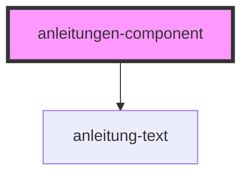

# anleitungen-component

<!-- Auto Generated Below -->

## Properties

| Property     | Attribute    | Description | Type      | Default     |
| ------------ | ------------ | ----------- | --------- | ----------- |
| `appearance` | `appearance` |             | `string`  | `undefined` |
| `header`     | `header`     |             | `string`  | `undefined` |
| `isopen`     | `isopen`     |             | `boolean` | `undefined` |

## Dependencies

### Depends on

- [anleitung-text](../anleitung-text)

### Graph

----------------------------------------------

*Built with [StencilJS](https://stenciljs.com/)*
